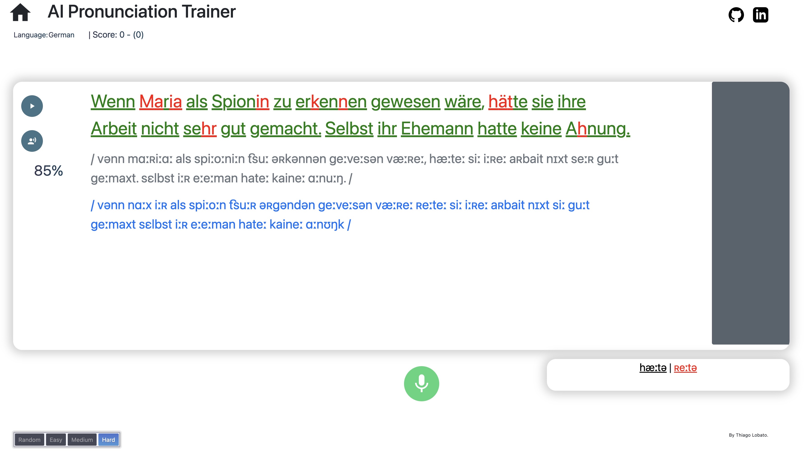

# AI Pronunciation Trainer

Ứng dụng web chấm điểm phát âm tiếng Anh bằng AI. Người học đọc một câu mẫu, hệ thống ghi âm, nhận dạng giọng nói, so sánh IPA theo từng âm vị và trả về điểm số, mức đúng/sai từng chữ cái kèm feedback sửa lỗi.



## Tính năng

- Chấm điểm phát âm theo **phoneme** và **chữ cái** (letter-level)
- Hỗ trợ **tiếng Anh Mỹ** (`en`) và **tiếng Anh Anh** (`en-gb`)
- Timestamp từng từ, phân loại từ good / medium / bad
- Feedback AI chi tiết cho từng từ phát âm sai (Groq – Llama 3.3 70B)
- Text-to-Speech để nghe câu mẫu (gTTS hoặc OpenAI TTS)

## Công nghệ

| Thành phần | Công nghệ |
|---|---|
| Backend | FastAPI, Uvicorn, Gunicorn |
| ASR + word timestamps | Whisper (`openai/whisper-base`, Transformers) |
| Nhận dạng IPA từ audio | Hugging Face Space `lgtitony/doan` (gradio_client) |
| IPA chuẩn | phonemizer / eSpeak NG, eng_to_ipa |
| Căn chỉnh chuỗi | Needleman–Wunsch / Hirschberg (`sequence_align`), DTW |
| AI Feedback | Groq API |
| TTS | gTTS, OpenAI `gpt-4o-mini-tts` |
| Frontend | HTML / CSS / JavaScript (Jinja2 template) |

## Cấu trúc thư mục

```
├── webApp.py                  # FastAPI app, định nghĩa các endpoint
├── lambdaSpeechToScore.py     # Xử lý audio → chấm điểm
├── lambdaGetSample.py         # Trả câu mẫu + IPA
├── lambdaTTS.py               # TTS bằng gTTS
├── lambdaTTSOpenAI.py         # TTS bằng OpenAI
├── pronunciationTrainer.py    # Pipeline chấm điểm chính
├── function.py                # IPA, căn chỉnh, so sánh phoneme, AI feedback
├── whisper_wrapper.py         # Wrapper Whisper ASR
├── models.py / AIModels.py    # Load ASR / TTS model
├── RuleBasedModels.py         # Chuyển text → IPA (US / UK)
├── WordMatching.py, WordMetrics.py
├── databases1/                # Bộ câu mẫu (en, de)
├── templates/main.html        # Giao diện
├── static/                    # CSS, JS, âm thanh phản hồi
└── gunicorn_config.py
```

## Cài đặt

### Yêu cầu

- Python 3.10+
- [FFmpeg](https://ffmpeg.org/) (có trong `PATH`)
- [eSpeak NG](https://github.com/espeak-ng/espeak-ng)

### Các bước

```bash
git clone https://github.com/hung1962003/AI_pronunciation.git
cd AI_pronunciation
pip install -r requirements.txt
```

Tạo file `.env`:

```env
GROQ_API_KEY=your_groq_key
HF_API_TOKEN=your_huggingface_token
OPENAI_API_KEY=your_openai_key      # tuỳ chọn, cho OpenAI TTS
```

> **Lưu ý:** `function.py` đang set cứng đường dẫn eSpeak cho Windows
> (`C:\Program Files\eSpeak NG\libespeak-ng.dll`). Trên Linux/macOS cần sửa lại, ví dụ
> `/usr/lib/x86_64-linux-gnu/libespeak-ng.so.1`.

## Chạy ứng dụng

Development:

```bash
uvicorn webApp:app --host 0.0.0.0 --port 8000
# hoặc
python webApp.py
```

Production:

```bash
gunicorn webApp:app -c gunicorn_config.py
```

Truy cập: http://127.0.0.1:8000/

Chi tiết xem [RUN.md](RUN.md).

## API

| Method | Endpoint | Mô tả |
|---|---|---|
| GET | `/` | Giao diện web |
| POST | `/getSample` | Lấy câu mẫu và IPA |
| POST | `/getAudioFromText` | TTS bằng gTTS |
| POST | `/getOpenAIAudioFromText` | TTS bằng OpenAI |
| POST | `/GetAccuracyFromRecordedAudio` | Chấm điểm phát âm |

Ví dụ request chấm điểm:

```json
{
  "title": "This is a sample sentence",
  "base64Audio": "data:audio/ogg;base64,AAA...",
  "language": "en"
}
```

Response gồm `pronunciation_accuracy`, `ipa_transcript`, `is_letter_correct_all_words`, `start_time`, `end_time`, `pair_accuracy_category`, `AIFeedback`,...

Tài liệu đầy đủ: [API_GetAccuracyFromRecordedAudio.md](API_GetAccuracyFromRecordedAudio.md).

## Luồng xử lý

1. Client gửi audio OGG (base64) + câu chuẩn
2. FFmpeg chuyển sang WAV 16 kHz mono
3. HF Space trả IPA của giọng đọc; Whisper lấy transcript + timestamp từng từ
4. Sinh IPA chuẩn từ câu mẫu, căn chỉnh với IPA ghi âm
5. So sánh phoneme → điểm từng từ và từng chữ cái
6. Groq LLM sinh feedback cho các từ sai

## Tác giả

**Nguyen Quang Hung** – [@hung1962003](https://github.com/hung1962003)
